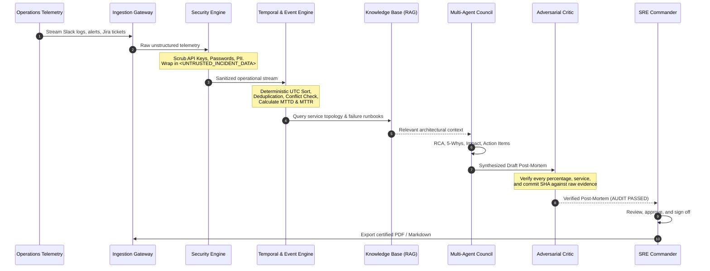
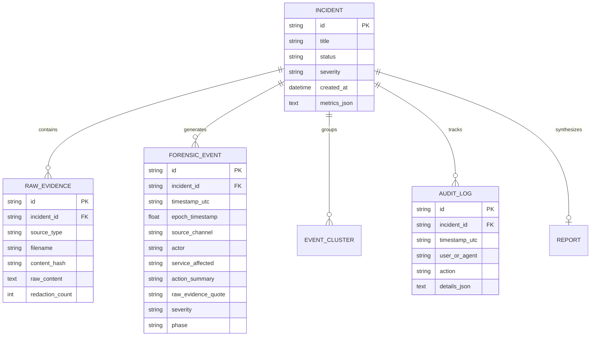

# ARCHITECTURE & SYSTEM DESIGN DOCUMENT
## AegisOps: Automated Incident Narrative Synthesis Platform

---

## 1. Executive Summary & Core Principle
AegisOps is an enterprise-grade Incident Intelligence Platform that solves the fundamental flaws of naive LLM summarization:
- **LLMs Hallucinate Numbers & Timestamps**: LLMs cannot reliably perform distributed timestamp arithmetic, timezone alignment, or chronological sorting.
- **LLMs Over-confidently Invent Root Causes**: Naive summarizers invent causal links not supported by telemetry.
- **LLMs are Vulnerable to Data-as-Instruction Injection**: Malicious or malformed log lines alter reasoning flow.

**Our Core Architectural Principle:**
> **NEVER TRUST THE LLM WITH DETERMINISTIC OPERATIONS.**  
> Probabilistic AI handles semantic extraction, reasoning, and narrative phrasing.  
> Deterministic Engineering handles timestamp normalization, chronological sorting, deduplication, conflict detection, MTTD/MTTR math, and cryptographic evidence hashing.

---

## 2. End-to-End Pipeline Flow

```mermaid
flowchart TD
    A[Multi-Source Evidence\nSlack, Datadog, Jira, Logs, CI/CD] --> B[Ingestion Gateway\nFile Parsers & Type Detection]
    B --> C[Security & Sanitization Engine\nPII, Secret Masking & Untrusted Data Wrapper]
    C --> D[Temporal Normalization Engine\nTimezone to UTC & Relative Time Anchor]
    D --> E[Forensic Event Extraction Agent\nVerbatim Evidence Quotes & Actor Attribution]
    E --> F[Deterministic State Engine\nPython Sorting, Dedup & Clustering]
    F --> G[Conflict Detection Engine\nDiscrepancy Identification: Slack vs Jira]
    G --> H[Hybrid RAG Knowledge Layer\nBM25 + Dense Vectors over Runbooks & Topology]
    H --> I[Multi-Agent Reasoning Council]
    
    subgraph Reasoning ["Multi-Agent Reasoning Council"]
        I1[RCA Specialist Agent\n5-Whys & Failure Path]
        I2[Impact Analysis Agent\nBlast Radius & Metrics]
        I3[Severity Agent\nP0-P3 Enterprise Policy]
        I4[Action Item Agent\nMeasurable Tasks & Owners]
    end
    I --> Reasoning
    Reasoning --> J[Incident Synthesis Agent\n20-Section Post-Mortem]
    J --> K[Adversarial Critic / Fact Checker\nChecks Quotes, Metrics, SHAs & Services]
    
    K -- Fails Audit --> J
    K -- Passes Audit --> L[Human-in-the-Loop Review Center\nApprove, Flag, Reject, Edit]
    L --> M[Post-Mortem Distribution\nPDF, Markdown, HTML, JSON]
```

---

## 3. Sequence Diagram: Outage to Verified Post-Mortem

---

## 4. Entity-Relationship (ER) Schema

